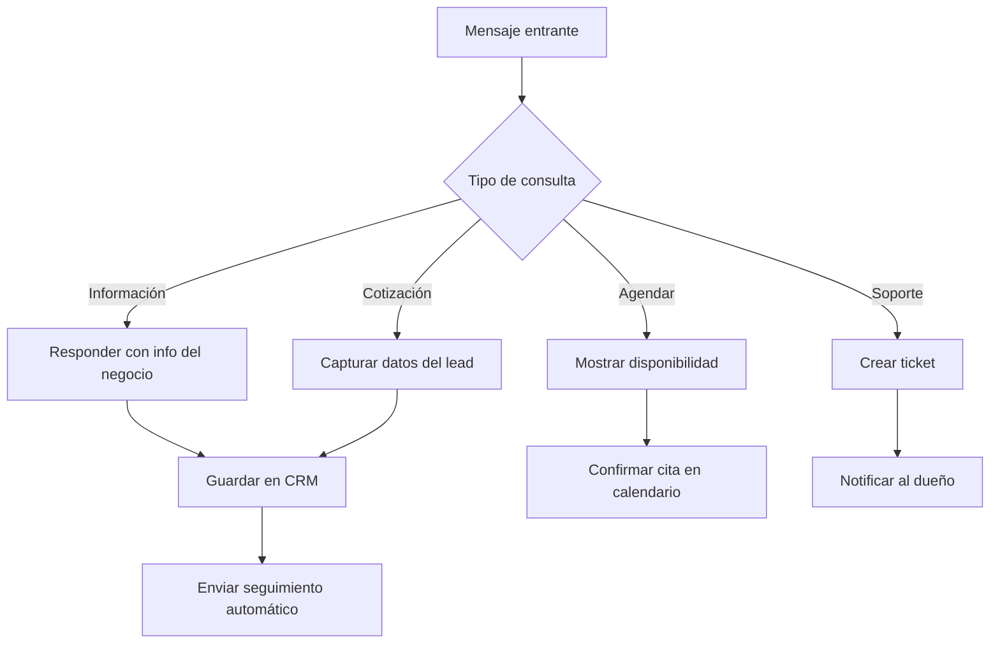
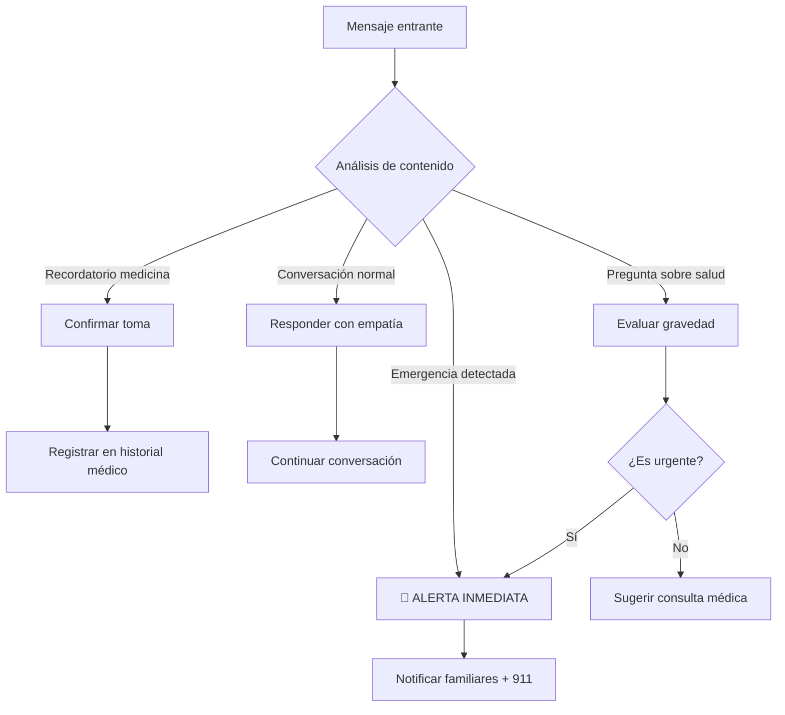

# 🤖 Sistema Conversacional Multi-Propósito - WhatsApp AI SaaS

## 🎯 Visión del Producto

Una plataforma SaaS que permite a diferentes tipos de usuarios crear asistentes conversacionales especializados vía WhatsApp, cada uno con su propia personalidad, conocimiento y flujos de trabajo.

---

## 📋 Casos de Uso Principales

### 1️⃣ **Asistente para Emprendedores**
**Objetivo:** Ayudar a emprendedores a gestionar su negocio, captar leads, responder clientes

**Funcionalidades:**
- ✅ Responder preguntas sobre productos/servicios
- ✅ Capturar leads automáticamente
- ✅ Agendar citas/reuniones
- ✅ Enviar cotizaciones
- ✅ Seguimiento de clientes potenciales
- ✅ Integración con CRM
- ✅ Analytics de conversiones

**Ejemplo de conversación:**
```
Cliente: "Hola, quisiera información sobre sus servicios"
Bot: "¡Hola! 👋 Soy el asistente de [Empresa]. Ofrecemos:
      1. Consultoría empresarial
      2. Marketing digital
      3. Desarrollo web
      ¿Cuál te interesa más?"
```

---

### 2️⃣ **Asistente para Cuidado de Personas Mayores**
**Objetivo:** Acompañar, recordar medicamentos, detectar emergencias, conectar con familiares

**Funcionalidades:**
- ✅ Recordatorios de medicamentos
- ✅ Compañía conversacional
- ✅ Detección de palabras clave de emergencia
- ✅ Notificaciones a familiares
- ✅ Agenda de citas médicas
- ✅ Ejercicios de memoria
- ✅ Monitoreo de bienestar

**Ejemplo de conversación:**
```
Adulto Mayor: "Me duele mucho el pecho"
Bot: "⚠️ Entiendo que tienes dolor en el pecho. Esto puede ser serio.
      ¿Puedes respirar con normalidad?
      
      [ALERTA ENVIADA A FAMILIARES Y CONTACTOS DE EMERGENCIA]"
```

---

### 3️⃣ **Otros Casos de Uso (Futuros)**
- 🏥 Asistente médico (triaje, citas)
- 🏫 Tutor educativo
- 🏨 Recepcionista virtual
- 🍕 Asistente de restaurante (pedidos)
- 💼 Reclutador automático

---

## 🏗️ Arquitectura del Sistema

```
┌─────────────────────────────────────────────────────────────┐
│                    DASHBOARD WEB                            │
│  - Registro/Login                                           │
│  - Selector de "Tipo de Asistente"                          │
│  - Configuración personalizada por tipo                     │
│  - Analytics específicos del caso de uso                    │
└─────────────────────────────────────────────────────────────┘
                            ↓
┌─────────────────────────────────────────────────────────────┐
│                  BACKEND API (Node.js)                      │
│  ┌──────────────────────────────────────────────────────┐   │
│  │  ROUTER DE ASISTENTES                                │   │
│  │  - Detecta tipo de asistente del usuario             │   │
│  │  - Carga configuración específica                    │   │
│  │  - Enruta a módulo correspondiente                   │   │
│  └──────────────────────────────────────────────────────┘   │
│                            ↓                                │
│  ┌──────────────┬──────────────┬──────────────┐            │
│  │  MÓDULO      │  MÓDULO      │  MÓDULO      │            │
│  │  EMPRENDEDOR │  CUIDADO     │  GENÉRICO    │            │
│  │              │  MAYORES     │              │            │
│  │  - Lead Gen  │  - Medicina  │  - Custom    │            │
│  │  - CRM       │  - Alertas   │              │            │
│  │  - Ventas    │  - Familia   │              │            │
│  └──────────────┴──────────────┴──────────────┘            │
└─────────────────────────────────────────────────────────────┘
                            ↓
┌─────────────────────────────────────────────────────────────┐
│              AI ENGINE (OpenAI + Custom Logic)              │
│  - System prompts especializados por tipo                   │
│  - Context management                                       │
│  - Intent detection                                         │
│  - Action triggers                                          │
└─────────────────────────────────────────────────────────────┘
                            ↓
┌─────────────────────────────────────────────────────────────┐
│                  WHATSAPP CLOUD API                         │
│  - Envío/Recepción de mensajes                             │
│  - Multimedia (imágenes, audio, documentos)                │
└─────────────────────────────────────────────────────────────┘
```

---

## 📊 Base de Datos - Extensión del Schema

### **Nueva tabla: `assistant_types`**

```sql
CREATE TABLE public.assistant_types (
    id UUID PRIMARY KEY DEFAULT gen_random_uuid(),
    code TEXT UNIQUE NOT NULL, -- 'entrepreneur', 'elderly_care', 'custom'
    name TEXT NOT NULL,
    description TEXT,
    icon TEXT,
    
    -- Default configuration
    default_system_prompt TEXT NOT NULL,
    default_features JSONB, -- { "lead_capture": true, "crm_sync": true }
    
    -- Pricing
    base_price_monthly DECIMAL(10, 2),
    message_cost DECIMAL(10, 4),
    
    is_active BOOLEAN DEFAULT true,
    created_at TIMESTAMPTZ DEFAULT NOW()
);

-- Insert default types
INSERT INTO public.assistant_types (code, name, description, default_system_prompt) VALUES
('entrepreneur', 'Asistente para Emprendedores', 'Ayuda a captar leads, responder clientes y gestionar ventas', 
 'Eres un asistente virtual profesional para un emprendedor. Tu objetivo es ayudar a captar leads, responder preguntas sobre productos/servicios, y agendar citas. Sé amigable, profesional y conciso.'),

('elderly_care', 'Asistente de Cuidado para Adultos Mayores', 'Acompaña, recuerda medicamentos y detecta emergencias',
 'Eres un asistente de cuidado para adultos mayores. Habla con paciencia, claridad y empatía. Detecta palabras clave de emergencia (dolor, caída, ayuda) y activa alertas. Recuerda medicamentos y citas médicas.');
```

### **Actualizar tabla: `bot_configs`**

```sql
ALTER TABLE public.bot_configs
ADD COLUMN assistant_type_id UUID REFERENCES public.assistant_types(id),
ADD COLUMN specialized_config JSONB; -- Configuración específica por tipo
```

---

## 🎨 Flujos de Conversación por Tipo

### **FLUJO 1: Asistente para Emprendedores**



**Intents detectados:**
- `info_producto` → Responder con catálogo
- `precio` → Enviar cotización
- `agendar` → Mostrar calendario
- `comprar` → Iniciar proceso de venta
- `reclamo` → Crear ticket de soporte

---

### **FLUJO 2: Asistente de Cuidado para Adultos Mayores**



**Palabras clave de emergencia:**
- `dolor pecho`, `no puedo respirar`, `caída`, `mareo fuerte`
- `sangre`, `desmayo`, `confusión`, `ayuda urgente`

**Recordatorios automáticos:**
- Medicamentos (horarios configurados)
- Citas médicas
- Ejercicios
- Hidratación

---

## 🚀 Plan de Desarrollo por Etapas

### **ETAPA 1: MVP - Core del Sistema (2-3 semanas)**

**Objetivo:** Sistema funcional con 1 tipo de asistente (Emprendedor)

**Tareas:**

1. **Base de datos** (2 días)
   - ✅ Ejecutar schema SaaS completo
   - ✅ Agregar tabla `assistant_types`
   - ✅ Seed data inicial

2. **Backend API** (5 días)
   - ✅ Sistema de autenticación (Supabase Auth)
   - ✅ CRUD de WhatsApp accounts
   - ✅ Webhook handler multi-tenant
   - ✅ Router de asistentes
   - ✅ Módulo "Emprendedor" básico

3. **Dashboard Web** (5 días)
   - ✅ Login/Registro
   - ✅ Onboarding (conectar WhatsApp)
   - ✅ Configuración de asistente
   - ✅ Vista de conversaciones
   - ✅ Analytics básicos

4. **Integración WhatsApp** (3 días)
   - ✅ Conectar Cloud API
   - ✅ Webhook verification
   - ✅ Envío/recepción de mensajes
   - ✅ Testing end-to-end

**Entregable:** Dashboard funcional donde un emprendedor puede conectar su WhatsApp y recibir respuestas automáticas con AI.

---

### **ETAPA 2: Asistente de Cuidado para Adultos Mayores (2 semanas)**

**Objetivo:** Agregar segundo tipo de asistente con funcionalidades especializadas

**Tareas:**

1. **Módulo de Cuidado** (4 días)
   - ✅ Sistema de detección de emergencias
   - ✅ Alertas a familiares (SMS/WhatsApp/Email)
   - ✅ Recordatorios programados
   - ✅ Historial médico básico

2. **Dashboard especializado** (3 días)
   - ✅ Panel para familiares
   - ✅ Configuración de contactos de emergencia
   - ✅ Programación de medicamentos
   - ✅ Historial de conversaciones con alertas

3. **NLP mejorado** (3 días)
   - ✅ Detección de sentimientos
   - ✅ Análisis de urgencia
   - ✅ Context-aware responses

**Entregable:** Sistema con 2 tipos de asistentes funcionando en paralelo.

---

### **ETAPA 3: Plataforma SaaS Completa (3 semanas)**

**Objetivo:** Convertir en producto comercial multi-tenant

**Tareas:**

1. **Sistema de pagos** (5 días)
   - ✅ Integración Stripe/MercadoPago
   - ✅ Planes: Free, Starter, Pro, Enterprise
   - ✅ Límites de uso
   - ✅ Billing automático

2. **Analytics avanzados** (4 días)
   - ✅ Dashboard de métricas
   - ✅ Reportes exportables
   - ✅ Insights con AI

3. **Marketplace de asistentes** (5 días)
   - ✅ Plantillas pre-configuradas
   - ✅ Asistentes creados por la comunidad
   - ✅ Sistema de rating

4. **Optimización y escalabilidad** (4 días)
   - ✅ Caching (Redis)
   - ✅ Queue system (Bull)
   - ✅ Load balancing
   - ✅ Monitoring (Sentry)

**Entregable:** Plataforma SaaS lista para lanzamiento público.

---

### **ETAPA 4: Expansión (Ongoing)**

**Nuevos tipos de asistentes:**
- 🏥 Asistente médico (triaje)
- 🏫 Tutor educativo
- 🏨 Recepcionista virtual
- 🍕 Asistente de restaurante

**Integraciones:**
- Calendly (agendamiento)
- Google Calendar
- Zapier
- HubSpot CRM
- Notion

---

## 💰 Modelo de Negocio

### **Planes de Suscripción**

| Plan | Precio/mes | Mensajes | Asistentes | Características |
|------|------------|----------|------------|-----------------|
| **Free** | $0 | 100 | 1 | Básico, sin analytics |
| **Starter** | $29 | 1,000 | 2 | Analytics, CRM básico |
| **Pro** | $99 | 10,000 | 5 | Todo + integraciones |
| **Enterprise** | Custom | Ilimitado | Ilimitado | Soporte dedicado |

### **Casos de uso especiales:**

**Cuidado de Adultos Mayores:**
- Plan familiar: $49/mes (incluye alertas a 5 familiares)
- Plan residencia: $299/mes (hasta 50 residentes)

---

## 🛠️ Stack Tecnológico

### **Frontend**
- React + Vite
- TailwindCSS
- Recharts (analytics)
- React Router
- Zustand (state management)

### **Backend**
- Node.js + Express
- Supabase (DB + Auth)
- Bull (job queue)
- Redis (cache)
- Socket.io (real-time)

### **AI**
- OpenAI GPT-4o (conversación)
- Whisper (voz)
- ElevenLabs (TTS)
- LangChain (orchestration)

### **Infraestructura**
- Render (hosting)
- Cloudflare (CDN)
- Sentry (monitoring)
- PostHog (analytics)

---

## 📈 Métricas de Éxito

### **KPIs por tipo de asistente:**

**Emprendedor:**
- Tasa de conversión de leads
- Tiempo de respuesta promedio
- Satisfacción del cliente (CSAT)
- ROI del bot

**Cuidado Adultos Mayores:**
- Tiempo de respuesta a emergencias
- Adherencia a medicamentos
- Satisfacción de familiares
- Incidentes prevenidos

---

## 🎯 Próximos Pasos Inmediatos

1. ✅ **Validar el schema de base de datos** (ya creado)
2. ✅ **Crear el módulo de router de asistentes**
3. ✅ **Implementar primer asistente (Emprendedor)**
4. ✅ **Diseñar UI del dashboard**
5. ✅ **Testing con usuarios reales**

---

¿Quieres que empiece a desarrollar alguna etapa específica? 🚀
